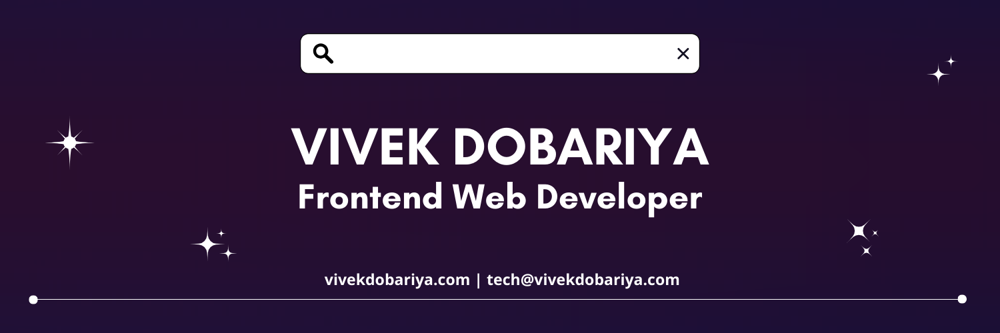

<h1 align='center'>
  
</h1>

<h3 align="center">A passionate frontend developer from India  </h3>

  

 

 

🌱 I’m currently learning **Next js by doing Project**

👨‍💻 All of my projects are available at [vivekdobariya.com](vivekdobariya.com)

📄 Know about my experiences at my **[LinkedIn Profile](https://linkedin.com/in/vivekdobariya)**

📫 How to reach me **tech@vivekdobariya.com**

💬 Ask me about **Frontend Development**

⚡ Fun fact **I am funny😅**

## 🔰 Let's Connect:

## ♨ Languages and Tools:

##  Github Stats:

